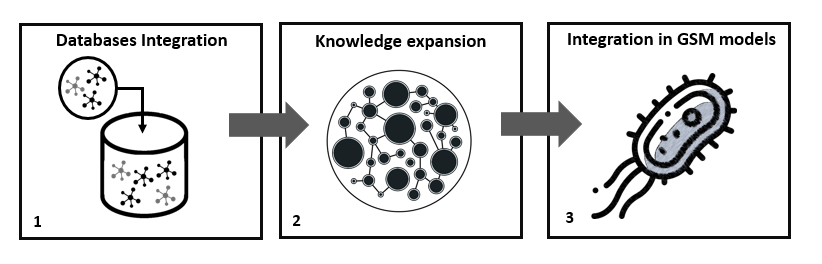
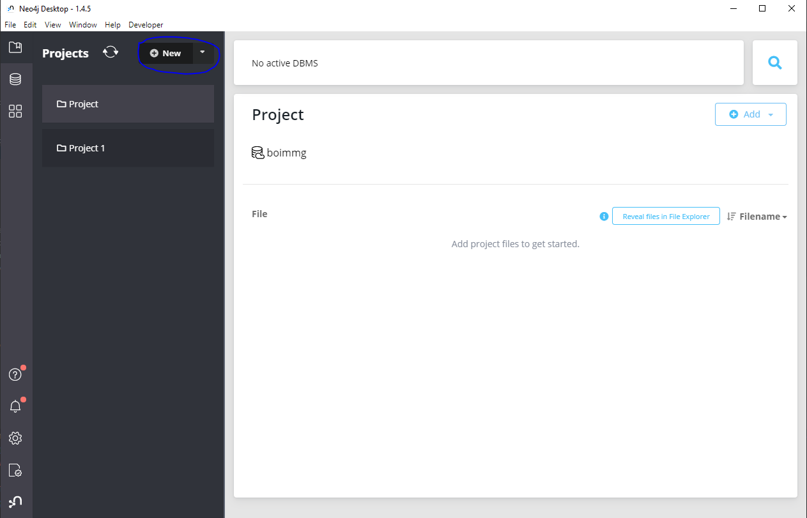
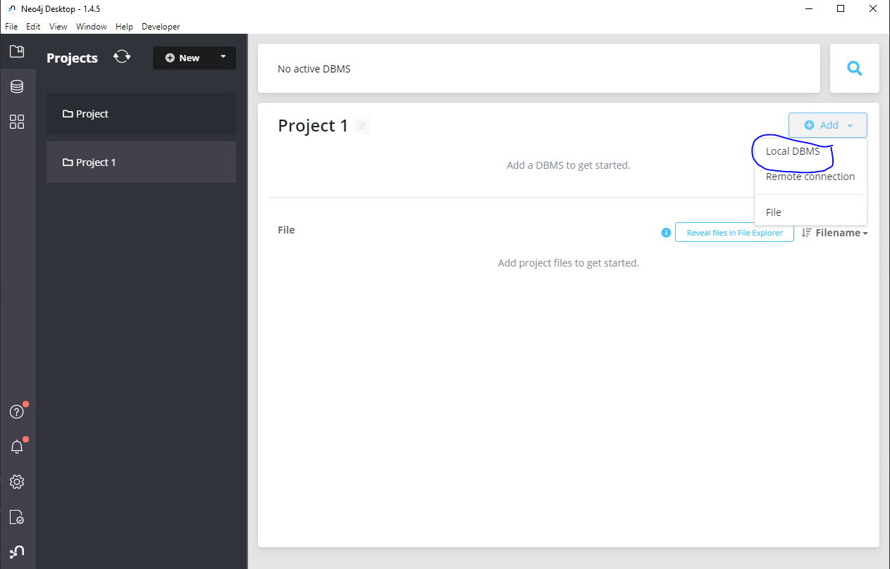
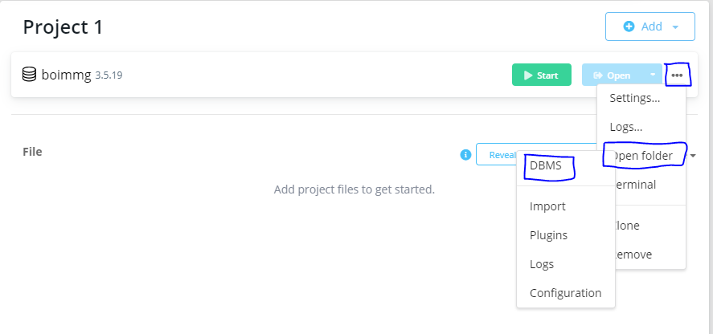
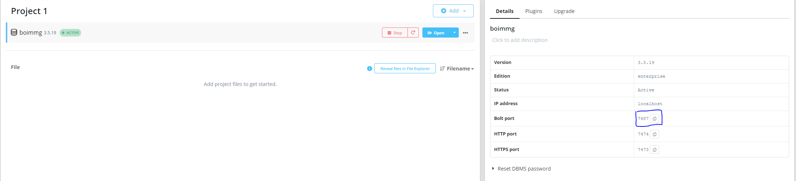
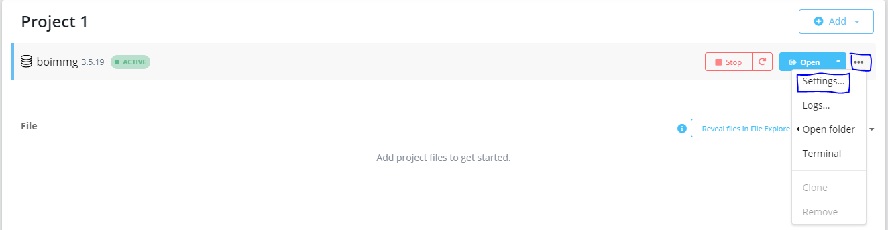

# Biochemical cOmplex data Integration in Metabolic Models at Genome-scale (BOIMMG)

### Description
Several ontologies were designed to represent the structural relationships between chemical species. However, they fail in capturing the functional relationships between compounds and their biosynthetic precursors. This is highly relevant in the context of GSM modelling, as it eases the process of converting generic biosynthetic pathways into specific ones and vice-versa. Moreover, to the best of our knowledge, there is not any computational approach to integrate such information.

BOIMMG is a novel and modular approach aiming at tackling several issues in the representation of lipids in GSM models.  


* Figure 1 - BOIMMG's pipeline - 1 - Integration of several databases; 2 -Semi-automated knowledge expansion 3 - integration of those ontologies into GSM models

In this frame, you are going to find the 2nd and 3rd modules only. The 2nd module is present in the **ontologies_generators** folder inside **boimmgpy** folder, whereas the latter is in a package format in **boimmgpy/service/**.

If one wants to test for the case studies, the **case_studies** folder is provided. However, one would need either the database with relevant information or the access to it, which is unfortunately not provided yet.

However, a web-service is available [here](https://boimmg.bio.di.uminho.pt/).

### Table of contents:

- [Requirements](#requirements)
- [Installation](#installation)
    - [Pip](#pip)
    - [Docker](#docker)
- [Getting Started](#getting-started)
    - [Access to the database](#)
    - [Compound Standardization](#compound-standardization)
    - [Compound Featurization](#compound-featurization)
    
- [About Us](#about-us)
- [Citing DeepMol](#citing-deepmol)


## Requirements

- rdkit
- cobra
- pandas
- numpy
- python-libsbml
- requests~=2.22.0
- biopython
- lxml
- openpyxl
- biocyc~=0.2.0
- sympy~=1.7.1
- neo4j~=4.2.1
- cobrababel~=0.1.3
- setuptools~=52.0.0
  

## Installation

### Pip

Install DeepMol via pip or conda:

```bash
pip install boimmg
```


### Docker

(IN PREPARATION - NOT FUNCTIONAL YET!)
1. Install [docker](https://docs.docker.com/install/).
2. Pull an existing image (X.XGb to download) from DockerHub:

```bash
docker pull XXX
```

or clone the repository and build it manually:

```bash
git clone 
docker build ...
```

3. Create a container:
```bash
docker run ...
```

### Manually

(IN PREPARATION - NOT FUNCTIONAL YET!)

Alternatively, install dependencies and BOIMMG manually.

1. Clone the repository:
```bash
git clone xx
```

3. Install dependencies:
```bash
python setup.py install
```

##Getting Started

BOIMMG is a package that compiles representation problems solutions for Genome Scale Metabolic Models (GSMM).
Currently, we provide tools to granulate lipids (LipidGranulator) and swap co-factors (CofactorSwapper).

BOIMMG framework is still under development and it is currently at a 
pre-release version. New models and features will be added in the future.


###Access to the database

BOIMMG provides an integrated database that compiles LIPID MAPS, Swiss Lipids and ModelSEED information. 
As for the access to the database, you can either use our rest API (default) or use a local database. 
The latter can be set up following the instructions bellow. 

####Set up a local BOIMMG's database from the command line

1. Download and install neo4j in https://neo4j.com/download/.
2. Download the database dump in https://zenodo.org/record/5163250/files/boimmg.dump.
3. Open neo4j desktop and create a new project.



4. Create a local DBMS in the created project.



5. Define the password and choose version 3.5.19.
6. Go to the database folder using the help of neo4j desktop GUI.



7. Now copy the folder path of the "bin" folder and go there in the command line.

```bash
cd <folder path of "bin" folder>
```

8. Load BOIMMG's database using **neo4j-admin**.

```bash
neo4j-admin load --from=<path to dump file> --database=graph.db
```

9. Go to your project in neo4j Desktop and start your database.

10. Press the database box and information will be displayed on the right. Copy the "bolt port".



11. The database is already set up, however, if you want to improve the performance of your database you should increase the heap maximum size. 
    For that you have to access to the database settings as in the figure bellow and change the parameter **dbms.memory.heap.max_size** 
    to the memory you want to allocate.
  


12. Finally, you are ready to set up the database in the package!


```python
from boimmgpy.database.accessors.compounds_database_accessor import set_database_information

set_database_information(uri="bolt://localhost:<bolt port>", user="neo4j", password="<your password>")
```

### LipidGranulator

The LipidGranulator allows you to convert your model's lipids from a generic to a structurally defined version

```python

model = cobra.io.read_sbml_model(definitions.ROOT_DIR + "/models/iMM904.xml")


```

### CofactorSwapper

```python
import cobra
from boimmgpy.representation_changers import CofactorSwapper

model = cobra.io.read_sbml_model("/models/iMM904.xml")

# The second parameter is the database format of the model: it can be ModelSEED, BiGG and KEGG
rep_case_solver = CofactorSwapper(model, "ModelSEED")
# Map the model so that internal processes can recognize which metabolites are in the model 
rep_case_solver.map_model()
# Swap cofactor: the first parameter is the database identifier of the cofactor 
# already in the model and the second is the database identifier of the cofactor that will replace the first
rep_case_solver.swap_compound("cpd15290", "cpd11669")
```


## About Us


## Citing BOIMMG

Manuscript under preparation.

## Licensing

 [BSD-2-Clause License]().
